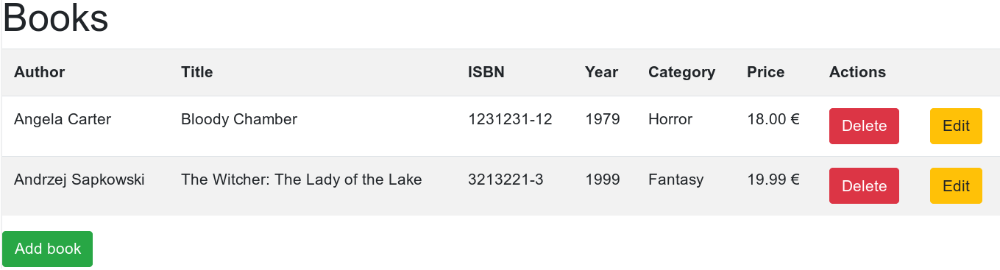

# Java Bookstore Project

_Front-end view_

_Database structure_

- This repository contains school-related Java server-side project work for an imaginary book store with required/necessary back-end features & course requirement description.

- This repository is linked to work of repository [java-server-programming - GitHub/Fincer](https://github.com/Fincer/java-server-programming).

- This repository is mirrored to [java-bookstore - Fjordtek Git/Fincer](https://fjordtek.com/git/Fincer/java-bookstore).

- This repository, although it contains references to my website domain (`com.fjordtek`), is not in production use in my [public server environment](https://fjordtek.com).

## Repository structure

| **Type** |        **Name**         |       **Description**     |
|----------|-------------------------|---------------------------|
| `Folder` | [bookstore](bookstore)  |    Main project folder    |
| `Folder` | [packaging](packaging)  | OS-specific build scripts |

### Recommendations

| **Software**  | **Version** |          **Description**          |
|---------------|-------------|-----------------------------------|
| Apache Tomcat |           9 | Web Server WAR package deployment |

## LICENSE

N/A (TBA)
