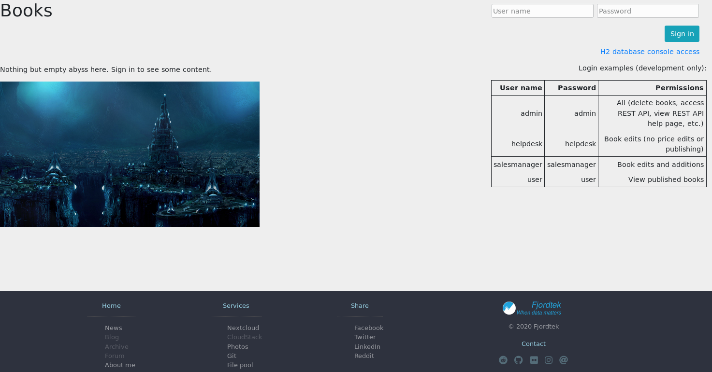

# Java Bookstore Project

## Introduction

- This repository contains school-related Java server-side project work for an imaginary book store with required/necessary back-end features & course requirement description.

- This repository is linked to work of repository [java-server-programming - GitHub/Fincer](https://github.com/Fincer/java-server-programming).

- This repository is mirrored to [java-bookstore - Fjordtek Git/Fincer](https://fjordtek.com/git/Fincer/java-bookstore).

- This repository, although it contains references to my website domain (`com.fjordtek`), is not in production use in my [public server environment](https://fjordtek.com).

## Overview

### Front page

_Front-end home page view with user sign-in form._

------------------------------

### Normal user view

_Normal user view for the bookstore: get basic information of published books._

------------------------------

### Sales manager view

_Sales manager view for the bookstore: view, edit and add books. Get published and unpublished books._

------------------------------

### Administrative view

_Administrative view for the bookstore: view, edit, delete and add books. Get published and unpublished books. Access REST API._

------------------------------

### Database structure

_[Bookstore database structure](db_plans/bookstore-model.mwb)_

------------------------------

## Repository structure

| **Type** |        **Name**         |        **Description**       |
|----------|-------------------------|------------------------------|
| `Folder` | [bookstore](bookstore)  |  Main project folder (Maven) |
| `Folder` | [packaging](packaging)  |  OS-specific build scripts   |
| `Folder` |  [db_plans](db_plans)   |  SQL Database plans & drafts |
| `Folder` |    [images](images)     | Various screenshots & images |

### Recommendations

| **Software**  | **Version** |          **Description**          |
|---------------|-------------|-----------------------------------|
| Apache Tomcat |           9 | Web Server WAR package deployment |

## LICENSE

N/A (TBA)
